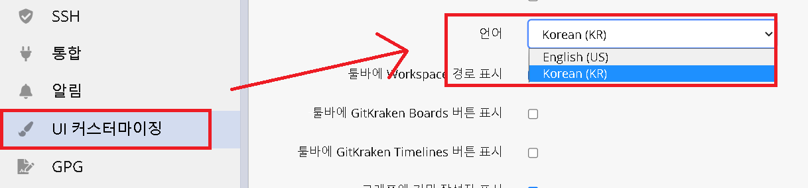

# gitkraken-korean

> GitKraken 한글화

## 개요

GitKraken 한글화 입니다.  
8.5.0 버전 기준 번역중에 있으며,  
약 4000라인 중 약 1500라인 번역하였습니다. (약 40%)  

## 언어 변경

### Script 실행
- [Release](https://github.com/shblue21/gitkraken-korean/releases) 다운 후 스크립트 실행 (윈도우)

### 직접 변경
1. 다음 경로로 이동.
   - 윈도우 : `%LOCALAPPDATA%\gitkraken\app-8.x.x\resources\app.asar.unpacked\src`
   - Mac: `/Applications/GitKraken.app/Contents/Resources/app.asar.unpacked/src/`
2. `app.asar.unpacked\src\en` 폴더 생성.
3. `app.asar.unpacked\src\strings.json` 파일 `src\en` 폴더로 이동.
4. [`resources\ko\lastest\strings.json`](https://raw.githubusercontent.com/shblue21/gitkraken-korean/main/resources/ko/lastest/strings.json) 파일 다운.
5. `app.asar.unpacked/src`에 복사
6. UI Customization 옵션에서 Language를 Korean으로 변경.

  

## Contribute

- 오역을 발견하거나, 번역하신경우 Pull-Request 주시면 감사드리겠습니다.

## License
[MIT License](https://raw.githubusercontent.com/shblue21/gitkraken-korean/main/LICENSE)